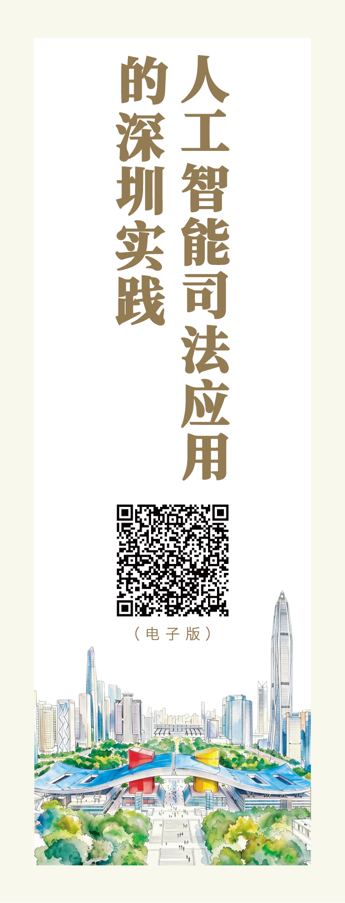
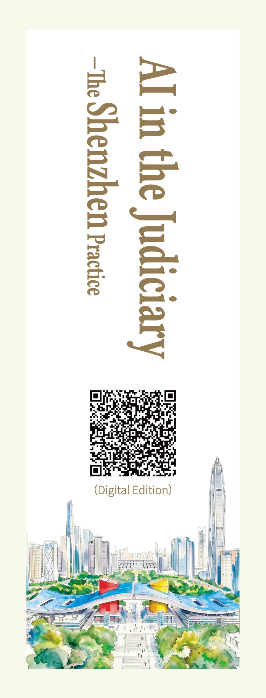

# 人工智能司法应用的深圳实践 / AI in the Judiciary: The Shenzhen Practice

白皮书，2026 年 9 月发布，中英双语。
发布单位：深圳市 / Issued by: Shenzhen Municipality

## 文件 / Files

| 版本 | 文件 | 页数 |
|---|---|---|
| 中文版 | [zh/人工智能司法应用的深圳实践-2026年9月.pdf](zh/人工智能司法应用的深圳实践-2026年9月.pdf) | 92 |
| English Edition | [en/AI-in-the-Judiciary-The-Shenzhen-Practice-2026-09.pdf](en/AI-in-the-Judiciary-The-Shenzhen-Practice-2026-09.pdf) | 84 |

**官方发布渠道 / Official channel**

白皮书电子版由「i深圳」平台发布。本仓库为镜像与长期存档。
The digital edition is published on the "i-Shenzhen" (i深圳) platform. This repository is a mirror and long-term archive.

- [中文版官方下载](https://isz-web.sz.gov.cn/static/isz/%E7%99%BD%E7%9A%AE%E4%B9%A6%EF%BC%9A%E4%BA%BA%E5%B7%A5%E6%99%BA%E8%83%BD%E5%8F%B8%E6%B3%95%E5%BA%94%E7%94%A8%E7%9A%84%E6%B7%B1%E5%9C%B3%E5%AE%9E%E8%B7%B5%EF%BC%88%E4%B8%AD%E6%96%87%E7%89%88%EF%BC%89.pdf)
- [English Edition, official download](https://isz-web.sz.gov.cn/static/isz/White%20Paper%EF%BC%9AAI%20in%20the%20Judiciary-The%20Shenzhen%20Practice%EF%BC%88English%20Edition%EF%BC%89.pdf)

## 引用 / How to cite

总 DOI（永远指向最新版）/ Concept DOI: https://doi.org/10.5281/zenodo.22975212  
本版 DOI / This version: https://doi.org/10.5281/zenodo.22975213

> 深圳市. 人工智能司法应用的深圳实践 [白皮书]. 2026 年 9 月. https://doi.org/10.5281/zenodo.22975213

> Shenzhen Municipality. (2026, September). *AI in the Judiciary: The Shenzhen Practice* [White paper]. https://doi.org/10.5281/zenodo.22975213

## 许可 / License

本作品采用 [CC BY-NC 4.0](https://creativecommons.org/licenses/by-nc/4.0/deed.zh-hans) 许可。
Licensed under [CC BY-NC 4.0](https://creativecommons.org/licenses/by-nc/4.0/).
